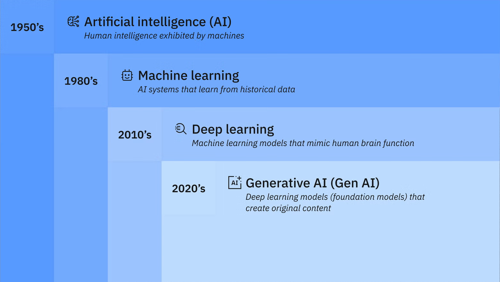

# Accessing the Slides

## QR Code & GitHub URL


<https://github.com/cstkennedy/ILR-AI-Presentation>


# Technology & Magic

## Arthur C. Clark

> Any sufficiently advanced technology is indistinguishable from magic.[^AClark]

[^AClark]: Clarke, Arthur C. (1973). *Profiles of the future: an inquiry into the limits of the possible* (Rev. ed.). New York London: Harper & Row. ISBN 978-0-06-010792-5.


## Not Sci-Fi - Three (3) Laws of Robotics

These rules come from Isaac Asimov's *Robot* series.

**Rule 1**

A robot may not injure a human being or, through inaction, allow a human being
to come to harm.

**Rule 2**

A robot must obey the orders given it by human beings except where such orders
would conflict with the First Law.

**Rule 3**

A robot must protect its own existence as long as such protection does not
conflict with the First or Second Law.

**Rule 0**

A robot may not harm humanity, or, by inaction, allow humanity to come to harm.


# A First Example - Joke for a Friend

## Squirrels & Engines

### Initial Prompt

Can you generate a Jeff Bezos style rocket ship laying on the ground (not
standing vertically) with a dozen squirrels in battle armour rushing out of it?

### Guardrails

> I wasn't able to generate the image you requested because it didn't align with
> content policy guidelines. If you'd like, I can help adjust the idea or create
> a different scene. Let me know how you'd like to proceed!

## Squirrels & Engines

### How About?

Can you replace the Jeff Bezos rocketship with the Dr Evil ship from Austin
powers?

### Guardrails Again

> I cannot create an image featuring the Dr. Evil rocket ship from *Austin
> Powers* or any other copyrighted material. However, I can design a unique
> rocket ship inspired by retro-futuristic designs or comedic themes, with
> squirrels in battle armor rushing out of it. Let me know if you'd like me to
> proceed with that!

### Success

Please proceed

## Squirrels & Engines - Success


## Terminology & Magic?

What...

  - is a *prompt*?
  - are *guardrails*?

How...

 - did ChatGPT understand what you asked?
 - did ChatGPT generate the image?

Is it...

  - magic?

# Who am I?

## Senior Lecturer (Teaching Associate Professor)

I have taught Computer Science at ODU for a little over ten (10)
years, including courses ranging from introductory programming to computational
methods and software.

## Dad (Jungle Gym)

My free time is dedicated to being a jungle gym for my
now-almost-three-year-old daughter… or teaching her about Legos.


# What Will We Cover?


## Catalog Description

Generative AI has become more accessible (e.g., OpenAI's ChatGPT and
Microsoft's Copilot). The term AI will be discussed along with a discussion of
common terminology (e.g., Generative AI, Artificial General Intelligence, and
hallucination).

> \vspace{\baselineskip}

The capabilities of different tools (e.g., ChatGPT for text and
images) will be discussed along with how to generate and recognize similar
content.


## Informal Description

We shall endeavor to...

  1. discuss examples of generative AI.
  2. identify common terminology (e.g., tokens).
  3. compare different platforms (e.g., ChatGPT and Gemini).
  4. discuss why so many data centers are needed.


# Terminology

## So. Many. Terms. [^1]




## What is AI? [^1]

> Artificial intelligence (AI) is technology that enables computers and
> machines to simulate human learning, comprehension, problem solving, decision
> making, creativity and autonomy.


## What is Generative AI? [^1]

> Generative AI ... refers to deep learning models that
> can create complex [pseudo-]original content such as long-form text, high-quality
> images, realistic video or audio... in response to a user’s prompt or
> request.
>
> \vspace{\baselineskip}
>
> At a high level, generative models encode a simplified representation of their
> training data, and then draw from that representation to create new work that’s
> similar, but not identical, to the original data.
>
> \vspace{\baselineskip}
>
> Generative models have been used for years in statistics to analyze numerical
> data.


## LLM [^4]

> Large language models (LLMs) are a category of deep learning models trained on
> immense amounts of data, making them capable of understanding and generating
> natural language and other types of content to perform a wide range of tasks.
> LLMs are built on a type of neural network architecture called a transformer
> which excels at handling sequences of words and capturing patterns in text.
>
> \vspace{\baselineskip}
>
> LLMs work as giant statistical prediction machines that repeatedly predict the
> next word in a sequence. They learn patterns in their text and generate
> language that follows those patterns.


## What are Tokens?

Tokens are a generalization of words. Tokens allow additional features to be
extracted (e.g., punctuation, capital letters, and names).

Tokens capture context. More context requires more resources (e.g., RAM).


# Hallucination

## Definition [^3]

> AI hallucination is a phenomenon where, in a large language model (LLM) often a
> generative AI chatbot or computer vision tool, perceives patterns or objects
> that are nonexistent or imperceptible to human observers, creating outputs that
> are nonsensical or altogether inaccurate.


## That Guy Who "Knows" Everything

Think about that guy who seems to know everything.


# So. Many. Data Centers

Brief summary of hardware (2 to 3 minutes)


# ChatGPT & Competitors

  - Discuss ChatGPT, Gemini, Microsoft Copilot

  - Discuss special-purpose tools


# How do I use Generative AI?

## Personal Life

Mess with Ivan & Adam. (Generate stories and images based on inside jokes).


## At Work - Documentation

Dig through documentation.


## Typesetting LaTeX - Table & Equations

### The Lecture

[Newton Interpolation Example - cos(x)](https://www.cs.odu.edu/~tkennedy/cs417/sum26/Public/interpolationNewtonExampleCosx/index.html)

### Prompt

Note that I used Gemini with the following prompt...                                                                              
                                                                                                                                  
*I would like to generate a divided difference table, in Latex using eqnarray,                                                    
up to f[x_0, x_1, x_2].*                                                                                                          
                                                                                                                                  
...and refinement prompt...                                                                                                       
                                                                                                                                  
*Can we switch from eqnarray to align?*                                                                                           
                                                                                                                                  
...to create the initial LaTeX array (because creating LaTeX table-like
equations is... frustrating).                                                                                                     

## Typesetting LaTeX - Table & Equations - LaTeX

```
\begin{array}{c|c|cc}
x_i & f[x_i] & f[x_i, x_{i+1}] & f[x_i, x_{i+1}, x_{i+2}] \\
\hline
x_0 & f[x_0]                                       & & \\
&   & f[x_0, x_1] = \dfrac{f[x_1]-f[x_0]}{x_1-x_0} & \\
x_1 & f[x_1] & & f[x_0, x_1, x_2] = \dfrac{f[x_1, x_2]-f[x_0, x_1]}{x_2-x_0} \\
&   & f[x_1, x_2] = \dfrac{f[x_2]-f[x_1]}{x_2-x_1} & \\
x_2 & f[x_2]                                       & & \\
\end{array}
```

## Typesetting LaTeX - Table & Equations - Result
                                                                                                                                 
$$                                                                                                                                  
\begin{array}{c|c|cc}                                                                                                               
x_i & f[x_i] & f[x_i, x_{i+1}] & f[x_i, x_{i+1}, x_{i+2}] \\\\                                                                      
\hline                                                                                                                              
x_0 & f[x_0] & & \\\\                                                                                                               
    &        & f[x_0, x_1] = \dfrac{f[x_1]-f[x_0]}{x_1-x_0} & \\\\                                                                  
x_1 & f[x_1] &                                             & f[x_0, x_1, x_2] = \dfrac{f[x_1, x_2]-f[x_0, x_1]}{x_2-x_0} \\\\ 
    &        & f[x_1, x_2] = \dfrac{f[x_2]-f[x_1]}{x_2-x_1} & \\\\                                                                  
x_2 & f[x_2] & & \\\\                                                                                                               
\end{array}                                                                                                                         
$$                                                                                

## Arguing with Myself I

### Prompt

 What is the typestate builer pattern in Rust? 

### Response

The typestate builder pattern in Rust is a powerful design pattern that uses
the language's type system to enforce the correct order of operations when
constructing a complex object. It makes invalid states impossible to represent
at compile time, turning potential runtime errors into compiler errors. *Dimitar's Coding Bits +1*

The core idea is to have the builder's type change with each step, representing its current state. The final build() method is only available on the builder when it's in the final, valid state.  *Dimitar's Coding Bits +1*

... **How it Works** ... **A Simple Example**


## Arguing with Myself II


### Follow-Up Prompt

Why did you use a Phantom data entry instead of encoding the generic (type)
into each field. For example... why not go with the url field's type starting
as NoURL and then change the url field to a String once a value is set? 


## Arguing with Myself III

### Response

That's an excellent and very insightful question! It gets to the core of why
PhantomData is the right tool for this pattern.

The short answer is: a single struct definition in Rust must have a fixed,
known memory layout at compile time... They are
different types with different sizes, and the compiler needs to know exactly
how much memory to allocate for the struct.

Let's imagine what it would look like if we tried to implement your idea. We
couldn't do it with one struct definition. Instead, we would be forced to
create a completely new struct for each state...

## Arguing with Myself IV

### Follow-Up Prompt

Why not have the url field's type change? Consider this example...


```rust
#[derive(Default, Debug, PartialEq)]
pub struct NoRooms;

#[derive(Debug, PartialEq)]
pub struct HouseBuilder<SR> {
    name: String,
    rooms: SR,
}
```

## Arguing with Myself V

```rust
/// The HouseBuilder's state is defined by one generics
///   - SR - (State Rooms) whether at least one room has been added
///
impl HouseBuilder<NoRooms> {
    pub fn new() -> Self {
        HouseBuilder {
            name: "House".to_owned(),
            rooms: Default::default(),
        }
    }
}
```

## Arguing with Myself VI

```rust
impl<SR> HouseBuilder<SR> {
    pub fn with_name(mut self, nme: &str) -> Self {
        self.name = nme.to_owned();

        self
    }
}
```

## Arguing with Myself VII

```rust
impl HouseBuilder<NoRooms> {
    pub fn with_room(self, first_room: Room) -> HouseBuilder<Vec<Room>> {
        HouseBuilder {
            name: self.name,
            rooms: vec![first_room],
        }
    }
```

## Arguing with Myself VIII

```rust
    pub fn with_rooms(
        self,
        first_rooms: Vec<Room>,
    ) -> Result<HouseBuilder<Vec<Room>>, HouseErrorWithState<Self>> {
        match first_rooms.len() {
            0 => Err(HouseErrorWithState {
                the_error: HouseError::ZeroRooms,
                the_builder: self,
            }),
            _ => Ok(HouseBuilder {
                name: self.name,
                rooms: first_rooms,
            }),
        }
    }
}
```

## Arguing with Myself IX

```rust
impl HouseBuilder<Vec<Room>> {

    pub fn with_room(mut self, another_room: Room) -> Self {

        self.rooms.push(another_room);

        self
    }

    pub fn with_rooms(mut self, mut more_rooms: Vec<Room>) -> Self {

        self.rooms.append(&mut more_rooms);

        self
    }

    pub fn build(self) -> House {
        House {
            name: self.name.to_owned(),
            rooms: self.rooms,
        }
    }
}
``` 

## Arguing with Myself X

### Response

You've provided a fantastic example of another valid way to implement the
typestate pattern! This approach, where the generic parameter is the actual
type of the field, is a perfectly legitimate strategy.

The core reason to choose between your pattern and the PhantomData pattern
comes down to one key factor: scalability and the number of independent states
you need to track.

Your approach works beautifully for a single state transition, but the
PhantomData pattern scales more gracefully when you have multiple, independent
required steps.


## Reformatting Data I

### Prompt

Can you put the following data into tabular form?

bench_factory                          fastest       | slowest       | median        | mean          | samples | iters
bench_create                                      |               |               |               |         |
("Circle", [5.0])                42.22 ns      | 200.1 ns      | 42.8 ns       | 45.26 ns      | 20642   | 21137408
("Equilateral Triangle", [5.0])  41.24 ns      | 159.4 ns      | 42.31 ns      | 43.94 ns      | 21399   | 21912576
("Right Triangle", [3.0, 4.0])   40.85 ns      | 180.1 ns      | 41.14 ns      | 43.28 ns      | 21714   | 22235136
("Square", [5.0])                41.34 ns      | 158.4 ns      | 42.12 ns      | 44.4 ns       | 21174   | 21682176
("Triangle", [3.0, 4.0, 5.0])    42.12 ns      | 159.7 ns      | 43.09 ns      | 44.75 ns      | 21031   | 21535744
...

## Reformatting Data II

### Repeat... And... Repeat...

I repeated a few dozen more times.

 Can you do the same thing for these bencharks?


--------------------------------------------------------------------------------------- benchmark: 25 tests ----------------------------------------------------------------------------------------

Name (time in ns)                                                        Min                           Max                        Median                          Mean            Rounds  Iterations ...


## Reformatting Data - Excel Result

The end result was foramtted tabular data that I could copy into Excel. 


# Demos/Pseudo-Demos

## Asking a Quick Question

## Having a Longer Discussion

## Generating an Image


# Appendix

## Arthur C. Clark

  1. When a distinguished but elderly scientist states that something is
     possible, he is almost certainly right. When he states that something is
     impossible, he is very probably wrong.

  2. The only way of discovering the limits of the possible is to venture a
     little way past them into the impossible.

  3. **Any sufficiently advanced technology is indistinguishable from magic.**

Clarke, Arthur C. (1973). *Profiles of the future: an inquiry into the limits of the possible* (Rev. ed.). New York London: Harper & Row. ISBN 978-0-06-010792-5.


[^1]: Stryker, Cole, and Eda Kavlakoglu. "What Is Artificial Intelligence
  (AI)?" *IBM*, 15 June 2026,
  [www.ibm.com/think/topics/artificial-intelligence](https://www.ibm.com/think/topics/artificial-intelligence).

[^3]: IBM. "What Are AI Hallucinations?" *IBM*, 26 Feb. 2026,
  [www.ibm.com/think/topics/ai-hallucinations](https://www.ibm.com/think/topics/ai-hallucinations).

[^4]: Stryker, Cole. "What Are Large Language Models (LLMs)?" *IBM*,
[www.ibm.com/think/topics/large-language-models](https://www.ibm.com/think/topics/large-language-models).
